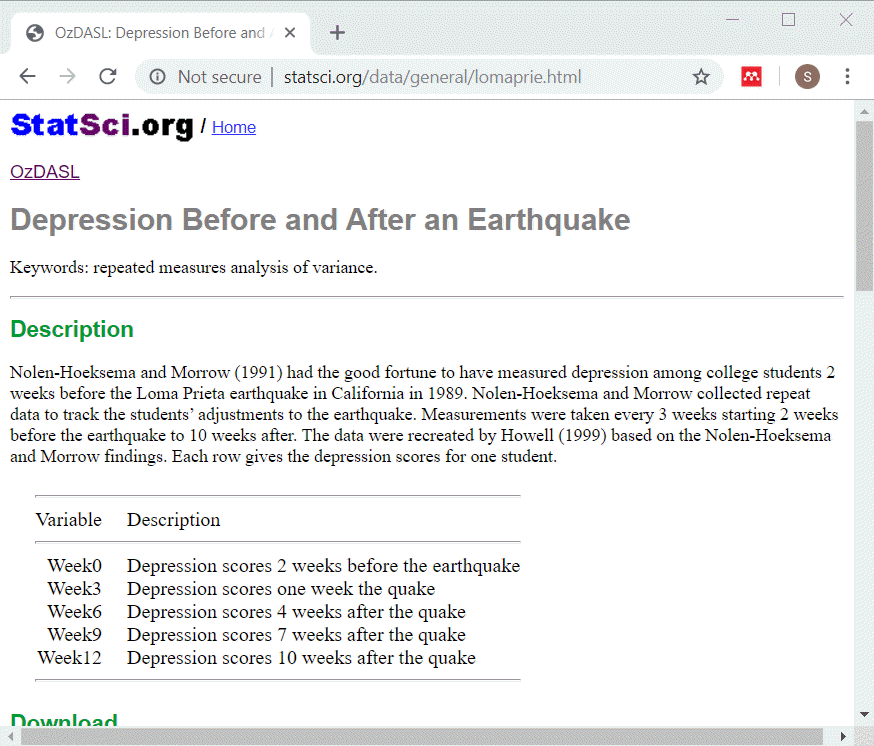
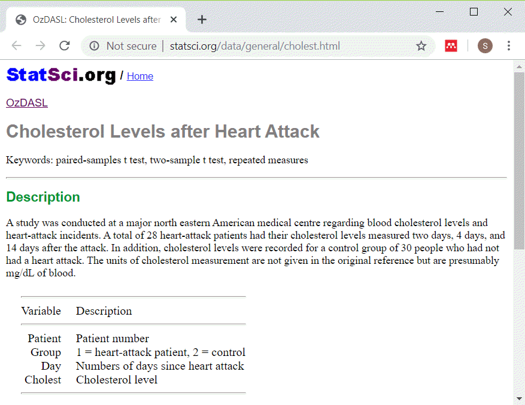

```{r setup, echo=FALSE}
knitr::opts_chunk$set(echo = FALSE)
suppressMessages(suppressWarnings(library(knitr)))
suppressMessages(suppressWarnings(library(magrittr)))
suppressMessages(suppressWarnings(library(sqldf)))
```

```{r connect}
db <- dbConnect(SQLite(), dbname="../data/melange.sqlite")
```

### Description of lomaprie data set



<div class="notes"> Speaker notes:

This data set displays depression scores among college students in a study planned for other purposes but which ended up with the baseline measurements collected just before a major California earthquake. The researchers seized the opportunity to assess changes in depression immediately before and after the earchquake as well as the recovery process longer term.

The source for this data set is

http://www.statsci.org/data/general/lomaprie.html

</div>

### lomaprie_db, listing of original table

```{r}
sql_code1 <- 
"select *
  from lomaprie
  limit 5"  
sql_code2 <- 
"select count(*) as n_records
   from lomaprie"
```

+ SQL code
```
`r sql_code1`

`r sql_code2`
```

### lomaprie_db, listing of original table
+ Output
```{r}
dbGetQuery(conn=db, sql_code1)
dbGetQuery(conn=db, sql_code2)
```

<div class="notes"> Speaker notes:

This is what the original data looks like. Notice that there is no primary key in this table. Normally this is a major flaw in any reasonable database, but let's ignore that for now.

</div>

### Gathering into a single column

```{r}
sql_code1 <- 
"select 
  id, week0 as depression, 0 as time
  from lomaprie
union select
  id, week3 as depression, 3 as time
  from lomaprie
union select
  id, week6 as depression, 6 as time
  from lomaprie"
```

+ SQL code
```
`r sql_code1`
```

### Gathering

```{r}
sql_code2 <- 
"union select
  id, week9 as depression, 9 as time
  from lomaprie
union 
  select id, week12 as depression, 12 as time
  from lomaprie
limit 13"
```
+ SQL code, continued
```
`r sql_code2`
```

<div class="notes"> Speaker notes:


</div>


### Gathering
+ Output
```{r}
dbGetQuery(conn=db, 
  paste(sql_code1, sql_code2, sep="\n"))
```

<div class="notes"> Speaker notes:


</div>

```{r disconnect-and-reconnect}
dbDisconnect(db)
db <- dbConnect(SQLite(), dbname="../data/melange.sqlite")
```

### Description of cholestg data set



<div class="notes"> Speaker notes:

This data set shows cholesterol levels for patients after a heart attack. I simplified the data by removing the control patients.

The source for this data set is

[STatSci.org](http://www.statsci.org/data/general/cholest.html)

</div>

### cholesterol, listing of original table

```{r}
sql_code1 <- 
"select *
  from cholesterol
  order by patient, day
  limit 10
"
sql_code2 <- 
"select count(*) as n_records
   from cholesterol"
```

+ SQL code
```
`r sql_code1`

`r sql_code2`
```

### cholestg_1_db, listing of original table
+ Output
```{r}
dbGetQuery(conn=db, sql_code1)
dbGetQuery(conn=db, sql_code2)
```

<div class="notes"> Speaker notes:

This is what the original data looks like.

</div>


### cholestg_1_db, count of days

```{r}
sql_code1 <- 
"select day, count(day) as n_days
  from cholesterol
  group by day"  
```

+ SQL code
```
`r sql_code1`
```

+ Output
```{r}
dbGetQuery(conn=db, sql_code1)
```

### Spreading across multiple columns

```{r}
sql_code1 <- 
"select d2.patient, d2.cholest as chol02, 
  d14.cholest as chol14
  from cholesterol as d2
  left join cholesterol as d14
  on d2.patient=d14.patient
  where d2.day=2 and d14.day=14
  limit 10
"
```

+ SQL code
```
`r sql_code1`
```

### Spreading across multiple columns

+ Output
```{r}
dbGetQuery(conn=db, sql_code1)
```

### Spreading across multiple columns, Take 2

```{r}
sql_code1 <- 
"select d2.patient, d2.cholest as chol02, 
  d14.cholest as chol14
  from cholesterol as d2
  left join cholesterol as d14
  on d2.patient=d14.patient and 
    d2.day=2 and d14.day=14
  limit 10
"
```

+ SQL code
```
`r sql_code1`
```

### Spreading across multiple columns, Take 2

+ Output
```{r}
dbGetQuery(conn=db, sql_code1)
```

```{r disconnect-and-reconnect-2}
dbDisconnect(db)
db <- dbConnect(SQLite(), dbname="../data/melange.sqlite")
```

### Entity-Attribute-Value format

```{r}
sql_code1 <- 
"select *
  from eav
  limit 12"  
dbGetQuery(conn=db, sql_code1)
```

### Advantages of Entity-Attribute-Value format
+ Universal format
+ Easy to add fields
+ Ideal for sparse matrices
  + Sparse: most entries are zero
  
### Spreading the EAV format

```{r}
sql_code1 <- 
"select 
  d1.entity, 
  d1.value as age, 
  d2.value as fev, 
  d3.value as ht, 
  d4.value as sex,
  d5.value as smoke
  from eav as d1
inner join eav as d2
  on d1.attribute='age' and 
     d2.attribute='fev' and 
     d1.entity=d2.entity
"
```

+ SQL code
```
`r sql_code1`
```

### Spreading the EAV format

```{r}
sql_code2 <- 
"inner join eav as d3
  on d3.attribute='ht' and 
     d1.entity=d3.entity
inner join eav as d4
  on d4.attribute='sex' and 
     d1.entity=d4.entity
inner join eav as d5
  on d5.attribute='sex' and 
     d1.entity=d5.entity
  limit 10
"
```
+ SQL code, continued
```
`r sql_code2`
```

<div class="notes"> Speaker notes:


</div>


### Spreading the EAV format
+ Output
```{r}
dbGetQuery(conn=db, 
  paste(sql_code1, sql_code2, sep="\n"))
```

<div class="notes"> Speaker notes:


</div>

### Spreading the EAV format

```{r}
sql_code1 <- 
"select 
  entity, value as age
  from eav
  where entity in (
    select entity from eav
    where attribute='smoke' and value=1
  ) and attribute='age'
limit 10
"
```

+ SQL code
```
`r sql_code1`
```

### Spreading the EAV format
+ Output
```{r}
dbGetQuery(conn=db, sql_code1)
```

<div class="notes"> Speaker notes:


</div>


```{r disconnect}
dbDisconnect(db)
```
