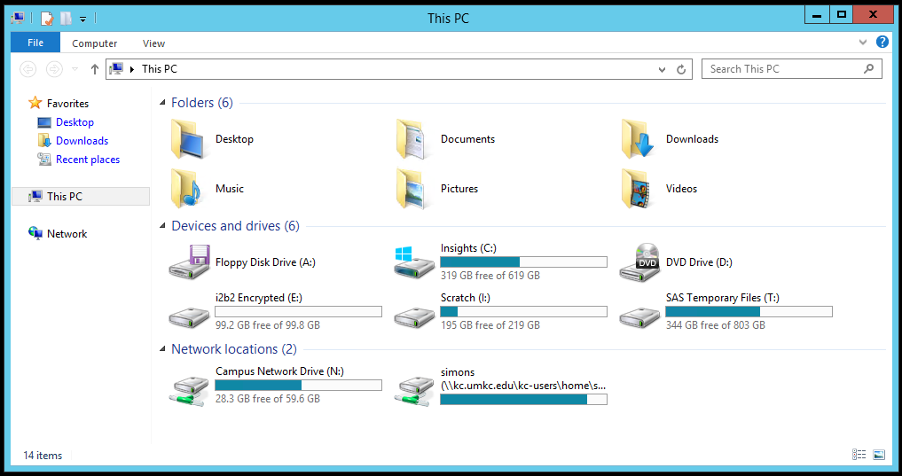
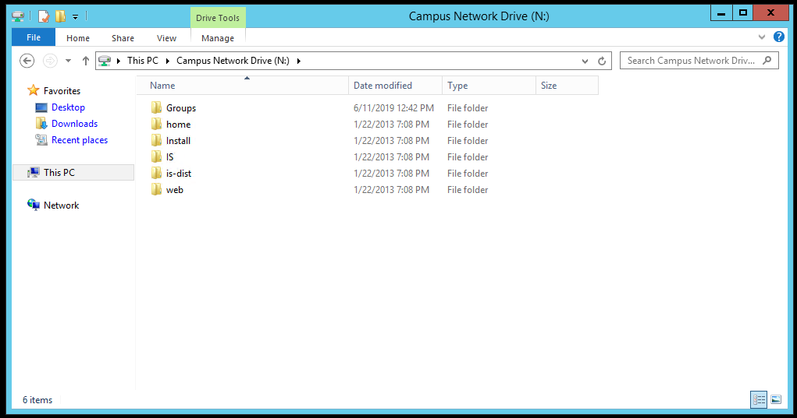
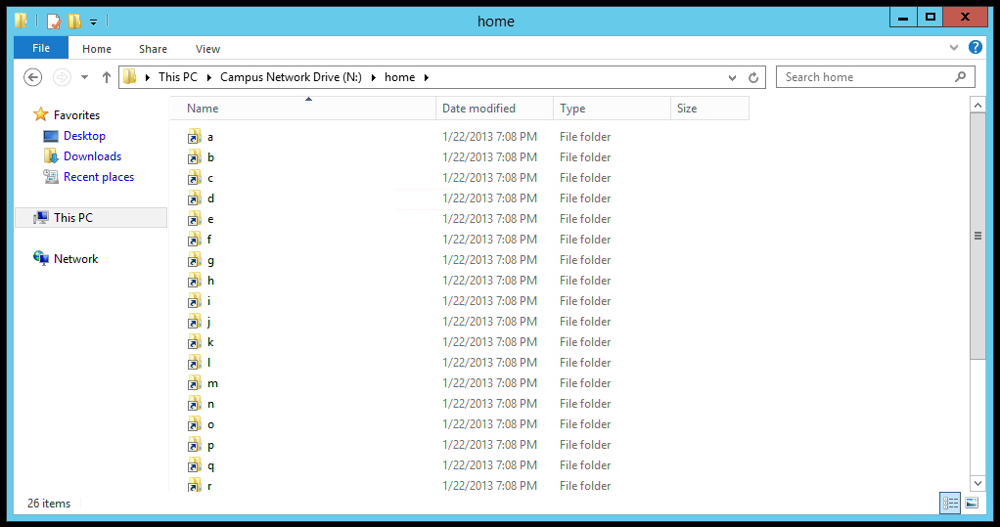
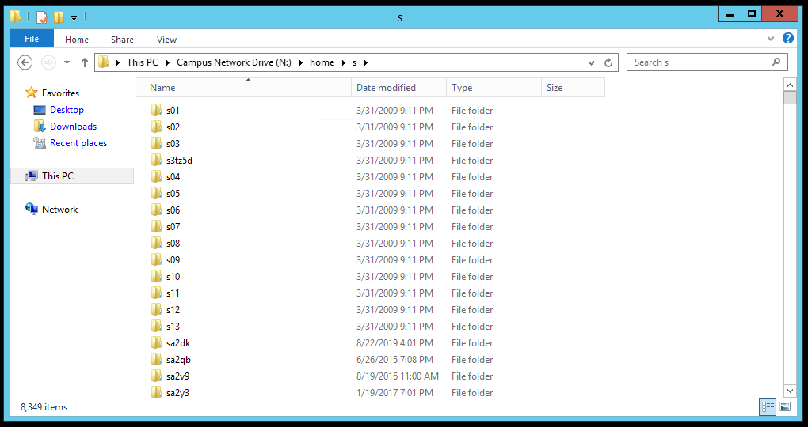
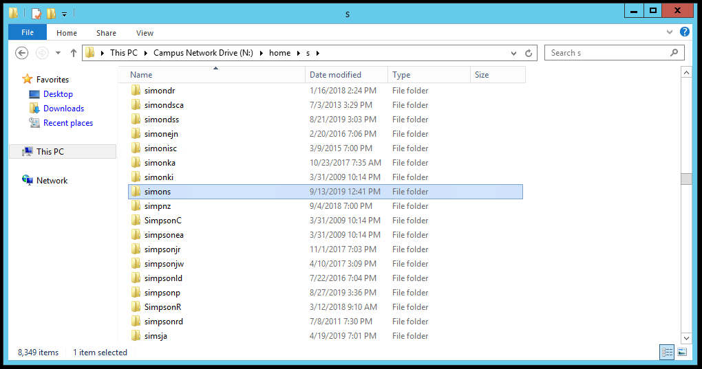
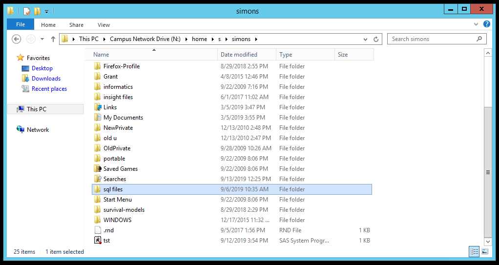
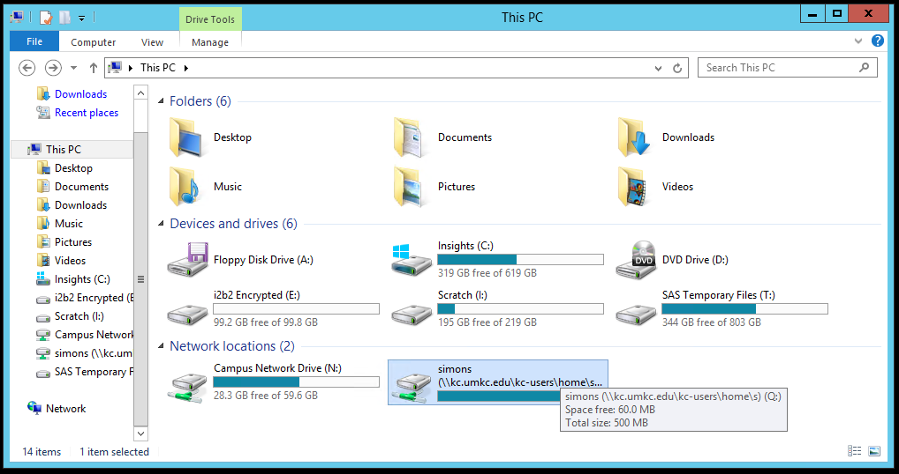
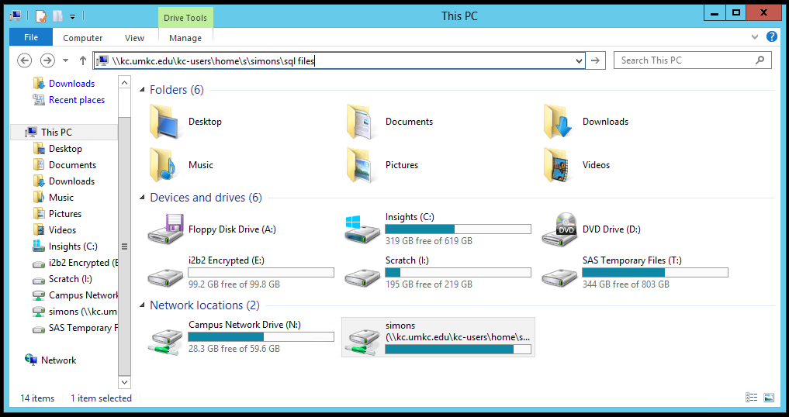

### What to do if you can't find your network folder
+ Don't panic
+ Two backdoor approaches
  + N:/home/s/simons
  + \\kc.umkc.edu\kc-users\home\s\simons

If you can't find your network folder, don't panic. There are two backdoor approaches that will let you access the files you need.

The first takes a long trip along the N: drive to get to where the Q: drive points to automatically. The second uses the "official" name for your private network folder.

### Look on the N: drive

If you are running a program on the UMKC Insights platform, the UMKC remote computer lab, or the UMKC student computer lab, you will need to use files stored on the network. None of these places will recognize locations on your own computer's hard drive or on a USB thumb drive or anything else locally.

Fortunately, UMKC students, faculty, and staff has access to a private set of network folders. These folders are on the Q: drive. Once in a while, you may lose track of your Q: drive. I'm not sure why it happens or how it happens, but there is no need to panic. There are at least two approaches that will work even if the Q: drive has decided to hide from you.

This is a screenshot from my computer system linking to the Insights platform. You will notice that there is not a Q: drive showing anywhere. Actually, the Q: drive right now is masquerading as the "simons" drive, but let's pretend that we can't see that either.

What you do see, and it is almost as good, is the N: drive. Normally, you use the N: drive to access group folders, but you can also navigate to your private network folders from N: as well.

### What the N: drive looks like

The N: drive has several folders, Groups, home, Install, etc. You want to peek at the "home" folder.

### The home folder on N:, alphabet soup

When you click on the home folder, you will see 26 directories with the single letters a through z.

### Choose the right letter

Now I choose the letter s, because my userid is simons. If your userid was lincolna, then you would select the "l" directory. If your userid was washingtong, then you would select the "w" directory. Notice that there are 8,349 directories here, because so many people at UMKC who have a userid starting with the letter s. Unless you were fortunate enough to be the son or daughter of Xena, Warrior Princess, your letter will have just as many folders.

### Scroll, and scroll, and scroll some more

It takes a while to scroll through 8,349 directories. I am looking for the directory corresponding to my userid. Ah! There it is. The simons directory.

### Found it. Hooray!

Once I have opened up the simons folder, I see exactly what I would have seen if I had opened up the Q: drive. Hooray!

But let me tell you about a second backdoor approach that works.

### Full filename for Q: is \\kc.umkc.edu\kc-users\home\s\simons

If you hover over the Q: drive letter in Windows Explorer, you will see the official name of the directory that is associated with the letter Q. It is \\kc.umkc.edu\kc-users\home\s for me, but for you that last letter might be "l" or "w" or "x". Tack on the name of your userid and you have the official network name for your folder.

### If Q is lost, use the official name instead

You can type this official name in the address bar, and you will delivered straight to your own special place on the UMKC network.

Now I'm showing how it works for me, but it will work for you also. You just have to substitute the correct letter and the correct userid.

