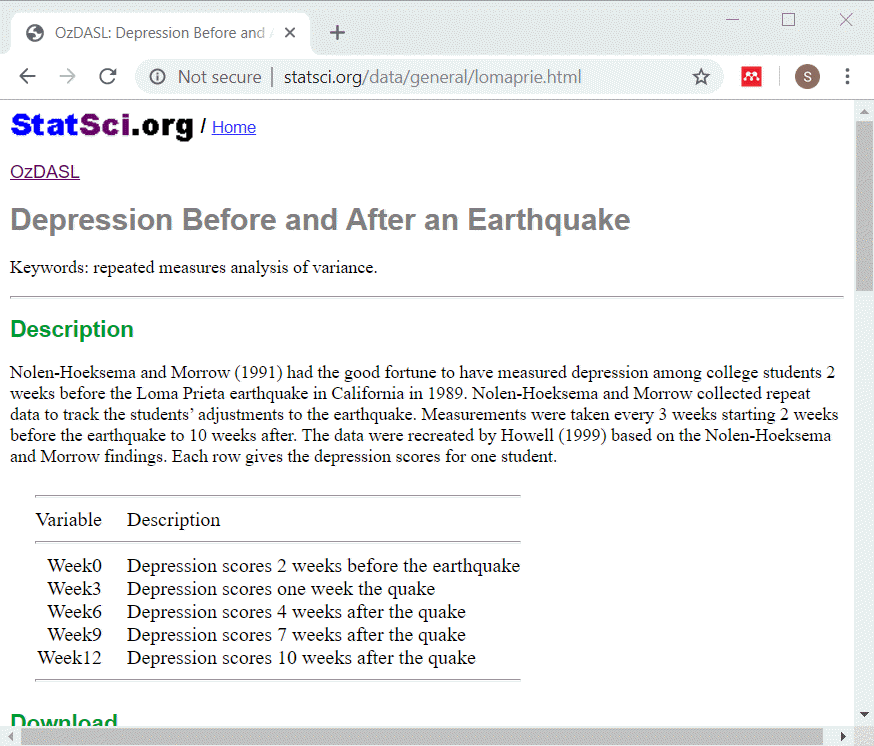

```{r setup, echo=FALSE}
knitr::opts_chunk$set(echo = FALSE)
suppressMessages(suppressWarnings(library(knitr)))
suppressMessages(suppressWarnings(library(magrittr)))
suppressMessages(suppressWarnings(library(sqldf)))
```

```{r connect}
db <- dbConnect(SQLite(), dbname="../data/lomaprie_db.sqlite")
```

### Description of lomaprie data set



<div class="notes">

This data set displays depression scores among college students in a study planned for other purposes but which ended up with the baseline measurements collected just before a major California earthquake. The researchers seized the opportunity to assess changes in depression immediately before and after the earchquake as well as the recovery process longer term.

The source for this data set is

http://www.statsci.org/data/general/lomaprie.html

</div>

### lomaprie_db, listing of original table

```{r}
sql_code1 <- 
"select *
  from earthquake_table
  limit 5"  
sql_code2 <- 
"select count(*) as n_records
   from earthquake_table"
```

+ SQL code
```
`r sql_code1`

`r sql_code2`
```

### lomaprie_db, listing of original table
+ Output
```{r}
dbGetQuery(conn=db, sql_code1)
dbGetQuery(conn=db, sql_code2)
```

<div class="notes">

This is what the original data looks like. Notice that there is no primary key in this table. Normally this is a major flaw in any reasonable database, but let's ignore that for now.

</div>

### Test slide
```
r01      1    1    2    2    3    3    4    4  4
r02 5    0    5    0    5    0    5    0    5  8
r03
r04      1    1    2    2    3    3    4    4  4
r05 5    0    5    0    5    0    5    0    5  8
r06
r07      1    1    2    2    3    3    4    4  4
r08 5    0    5    0    5    0    5    0    5  8
r09
r10      1    1    2    2    3    3    4    4  4
r11 5    0    5    0    5    0    5    0    5  8
r12
r13      1    1    2    2    3    3    4    4  4
r14 5    0    5    0    5    0    5    0    5  8
r15
```

### Restructuring

```{r}
sql_code1 <- 
"select 
  id, week0 as depression_score, 0 as time
  from earthquake_table
union select
  id, week3 as depression_score, 3 as time
  from earthquake_table
union select
  id, week6 as depression_score, 6 as time
  from earthquake_table"
```

+ SQL code
```
`r sql_code1`
```

### Restructuring, part 2

```{r}
sql_code2 <- 
"union select
  id, week9 as depression_score, 9 as time
  from earthquake_table
union 
  select id, week12 as depression_score, 12 as time
  from earthquake_table
limit 13"
```
+ SQL code, continued
```
`r sql_code2`
```

<div class="notes">


</div>

### Restructuring
+ Output
```{r}
dbGetQuery(conn=db, 
  paste(sql_code1, sql_code2, sep="\n"))
```

<div class="notes">


</div>

