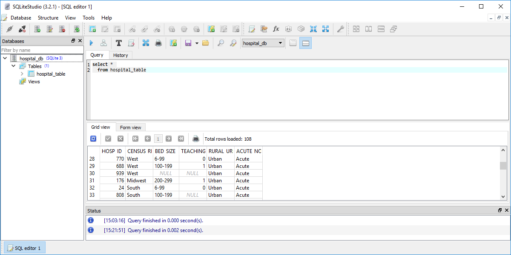
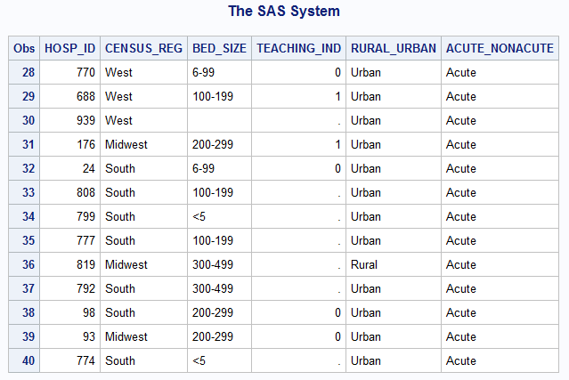
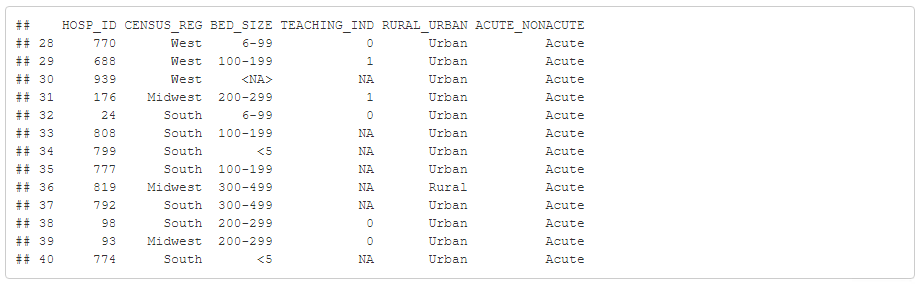

```{r setup, include=FALSE}
knitr::opts_chunk$set(echo = FALSE)
```

### Null values in SQL
+ Null is a special value in SQL
  + Typically intended to represent unknown or missing values
  + Always ask "why?"
+ Database designer may forbid use of null
  + Primary/foreign keys
+ Alternative, use special codes (-1 or 99)
  + Multiple codes for multiple reasons

<div class="notes">

It is with a bit of trepidation that I talk about null values. You might think "much ado about nothing" but that's not true.

The null value is a special value in SQL that is intended to represent unknown or missing values. You should always ask yourself why a value is missing because the reason it is missing will influence how you analyze the data. It is well beyond the scope of this course to discuss handling of missing values. I can make just one recommendation. Track missing values obsessively. 

Database designers will often forbid the use of null values for some or all of the fields in a database. We will talk a bit more about this when we discuss primary and foreign keys.

An alternative commonly used by database designers is the use of special codes to stand in for unknown or missing values. This is especially common for settings where there may be more than one reason why a value is missing.

</div>

### Example of null values in a database



<div class="notes">

Here's a peek at several rows of a database where there are some null values.

</div>

### SAS translation of null



<div class="notes">

When you import the data into SAS, SAS will convert numeric null values to a dot, which is the SAS code for missing values. For character values, SAS will convert null values to an empty string, a string of length zero. This may or may not be what you want.

</div>

### R translation of null

 

<div class="notes">

R will convert null values to NA if the field is numeric. It will convert to <NA> if the field is character.

</div>

### New data set with missing values

```{r}
suppressMessages(suppressWarnings(library(sqldf)))
db <- dbConnect(SQLite(), dbname="../data/titanic_db.sqlite")

sql_code <- 
"select Name, Age
  from titanic_table
  where Name like 'Bar%'"  
```

+ SQL code
```
`r sql_code`
```
+ Output
```{r}
dbGetQuery(conn=db, sql_code)
```

<div class="notes">

Here's a different database with null values. For this data set, the "Bar" names include two records with unknown ages.

</div>

### Counting is very important

```{r counting}
sql_code <- 
"select count(Name) as n_total
  from titanic_table"
```
+ SQL code
```
`r sql_code`
```
+ SQL output
```{r}
dbGetQuery(conn=db, sql_code)
```

<div class="notes">

I can't stress enough how important it is to get accurate counts when you have null values in your database. Here's the code to get an overall count of the number of records.

</div>

### Count of null values

```{r counting-is-null}
sql_code <- 
"select count(Name) as n_missing
  from titanic_table
  where Age is null"
```
+ SQL code
```
`r sql_code`
```
+ SQL output
```{r}
dbGetQuery(conn=db, sql_code)
```

<div class="notes">

You can (and should) get counts of all the null values.

</div>

### Count of not null values

```{r is-not-null}
sql_code <-
"select count(name) as n_valid
  from titanic_table
  where Age is not null"
```
+ SQL code
```
`r sql_code`
```
+ SQL output

```{r}
dbGetQuery(conn=db, sql_code)
```

<div class="notes">

You can exclude missing values using is not null.

</div>

### Your homework
+ Use the hospital database
  + Verify that HOSP_ID has no missing vales
  + Count the number of missing values for TEACHING_IND
  + Find the id of the hospital where BED_SIZE is null.
+ Place your results in a single pdf file

<div class="notes">

For your homework, use the hospital database that I mentioned briefly earlier in this lecture. Verify that the hospital id code (HOSP_ID) has no missing values. There are only two fields in the database that have null values. Get a count of the number of missing values for the indicator for teaching hospital (TEACHING_IND). There is only one hospital where the number of beds (BED_SIZE) is unknown. Find the id of that hospital.

</div>

### End of Part 1
+ What have you learned
  + Null represents missing or unknown
  + Translated to . (SAS) or NA (R)
  + is null
  + is not null
+ What's next (optional)
  + Statistical summaries for null values
  + Three valued logic
  
<div class="notes">

Let's take a break here. You've learned quite a bit in a few minutes. First, the null value in SQL is typically used to represent a missing or unknown value. When you import null values into SAS or R, these systems convert null values to the codes that they use for missing or unknown. You can't find null values with the equal sign (we'll explore this a bit more). Rather, you have to use the phrase "is null" or "is not null."

The next section is optional, but it's a lot of fun.

</div>

### Statistical summary functions

In SQL, statistical summary functions will remove missing values and calculate based only on the non-missing values. This is similar to the default options in SAS and SPSS, which also exclude missing values by default in most summary statistics. In R, however, the default option is to return a missing value for a summary statistic anytime that one or more values are missing.

### Statistical summary functions, avg

```{r average-with-nulls}
sql_code <- 
"select avg(age) as mean_age
  from titanic_table"
```
+ SQL code
```
`r sql_code`
```
+ SQL output
```{r}
dbGetQuery(conn=db, sql_code)
```

### Statistical summary functions, count
```{r count-with_nulls}
sql_code <- 
"select count(age) as n
  from titanic_table"
```
+ SQL code
```
`r sql_code`
```
+ SQL output
+ SQL output
```{r}
dbGetQuery(conn=db, sql_code)
```

<div class="notes">

The count function will toss out null values before counting.

</div>

### Comparisons with null values
```{r count-kids}
sql_code <- 
"select count(Name)
  from titanic_table
  where age<=18"
```
+ SQL code
```
`r sql_code`
```
+ SQL output
```{r}
dbGetQuery(conn=db, sql_code)
```

<div class="notes">

If you count the number of kids (age less than or equal to 18), you do not include the null values.

</div>


### The "opposite" comparison
```{r count-not-kids}
sql_code <- 
"select count(Name)
  from titanic_table
  where not age<=18"
```
+ SQL code
```
`r sql_code`
```
+ SQL output
```{r}
dbGetQuery(conn=db, sql_code)
```

<div class="notes">

If you count the number of kids (age less than or equal to 18), you do not include the null values.

The opposite condition also excludes null values. It seems odd that the number of cases with a statement plus all the cases with the negation of that statement should add up to less than the total. Think about that for a minute.

There is something unusual going on here. It is known as three valued logic.

</div>

### Three valued logic
+ What happens with a logic statement involving a null value?
  + Is null <= 18?
+ Unknown is a third logic value
  + Neither true nor false
  
<div class="notes">

A logic statement chokes when it encounters a null value. Is the value of null <= 18? Is it > 18? Well, it is neither. If age is null, that means that it is unknown, so maybe it is <= 18 and maybe it is not. Maybe doesn't fit well in a world of logic where statements are either true or false.

The folks at SQL developed a third logical value, unknown.

</div>

### Paradoxes of three valued logic (1/2)
+ Three valued logic system applied to the logic statement Age<=18
```
  Age  Age<=18?
   12      TRUE
   14      TRUE
   24     FALSE
 NULL   UNKNOWN
 ```
+ In a three valued logic system, comparisons to null are unknown

 <div class="notes">
 
The three valued logic assigns true to the logic statement age<=18 for the 12 and 14 year olds. It assigns false to that statement for the 24 year old. It assigns UNKNOWN to the null age.
 
</div>

### Paradoxes of three valued logic (2/2)
+ Three valued logic system applied to the logic statement not Age<=18
```
  Age  Age<=18?   not Age<=18
   12      TRUE         FALSE
   14      TRUE         FALSE
   24     FALSE          TRUE
 NULL   UNKNOWN       UNKWOWN
 ```
+ In a three valued logic system, not unknown is unknown
+ age<=18 or age>18?
  + Evaluates to unknown if age is null
 
 <div class="notes">
 
The three valued logic assigns true to the logic statement age<=18 for the 12 and 14 year olds. It assigns false to that statement for the 24 year old. It assigns UNKNOWN to the null age.
 
The negation of Age<=18 flips true to false and false to true, but it leaves unknown alone. In other words, not unknown is unknown. If you don't know if a passenger is a child, you don't know if a passenger is not a child.

The where clause includes true values and excludes false values and unknown values.

So the logic statement age<=18 or age>18 evaluates to true for almost everybody, but it evaluates to unknown if age is null. That seems wrong, doesn't it?

</div>

### Another paradox of three valued logic
+ Three valued logic system applied to the logic statement Age1=Age2
```
  Age1     Age2   Age1=Age2?
   12        18        FALSE
   14        14         TRUE
   26        39        FALSE
   24      NULL      UNKNOWN
 NULL        15      UNKNOWN
 NULL      NULL      UNKNOWN
 ```
+ Two null values could or could not be equal
  + Evaluates to unknown
 
<div class="notes">

Another paradox involves comparison between two different fields. If you have two ages, such as the age of a person and the age of that person's sibling, then it is pretty obvious what to do if you are asking the logical statement is the age of the patient and the age of his/her sibling the same. For 12 and 18, the answer if false. For 14 and 14, the answer is true. The 26 and 39, the answer is false. How about 24 and null? If you don't know the age of the sibling, then the comparison has to evaluate to unknown. Similarly if you don't know the age of the patient, and you do know the age of the sibling, you still have to evaluate to unknown.

What is interesting is when both ages are null. This also evaluates to unknown. The unknown ages might be 12 and 18, which would make the logic comparison false. Or they might both be 14. So it could just as easily be true. This should inform you that assigning either true or false won't work. So you have to assign a value of unknown.

</div>

### Logic table
```
       X   not X
    TRUE   FALSE 
   FALSE    TRUE
 UNKNOWN  UNKOWN
```

<div class="notes">

Here's a logic table for the not operator.

</div>

### Two valued logic table
```
       X        y   x or y  x and y
    TRUE     TRUE     TRUE     TRUE
    TRUE    FALSE     TRUE    FALSE
   FALSE     TRUE     TRUE    FALSE
   FALSE    FALSE    FALSE    FALSE
```

<div class="notes">

Here's a logic table for the "or" and "and" functions with just the two logic values of true and false. There are four combinations that work.

</div>

### Three valued logic table
```
       X        y   x or y  x and y
    TRUE     TRUE     TRUE     TRUE
    TRUE    FALSE     TRUE    FALSE
   FALSE     TRUE     TRUE    FALSE
   FALSE    FALSE    FALSE    FALSE
    TRUE  UNKNOWN     TRUE  UNKNOWN
   FALSE  UNKNOWN  UNKNOWN    FALSE
 UNKNOWN     TRUE     TRUE  UNKNOWN
 UNKNOWN    FALSE  UNKNOWN    FALSE
 UNKNOWN  UNKOWNN  UNKONWN  UNKNOWN
```

<div class="notes">

If you have to add in the unknowns, that creates five more cases.

</div>

### Do you really want all this hassle?
+ Debate about whether you should use null values at all
  + Never use them for identification codes
  + Replace them with extreme values (-1, 99)
+ Whatever your choice, tread carefully

<div class="notes">

There is a strong debate about whether you should use null values at all in databases. The potential for confusion is great. There is a general consensus that you should not use null values for identification codes. For other settings, you can use extreme codes like -1 and 99. Then you can track those codes explicitly because =-1 or =99 does not invoke the monster of three valued logic.

It is still tricky though. If the missing value code for age is -1 then you can't say age <= 18, you have to say age <=18 and age >= 0.

Now as an end user, you don't get to make this call. The lesson for you is that whenever you have missing or unknown values, you have to be alert to the troubles that they may cause.

</div>

```{r shut-down-gracefully}
dbDisconnect(conn=db)
```

### Conclusion
+ What have you learned.
  + SQL uses null values
  + is null, is not null
  + How statistical summaries handle null values
  + Three valued logic systems