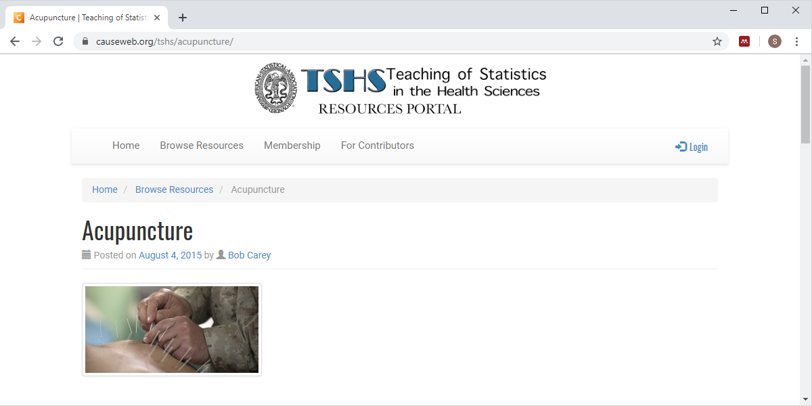

```{r setup, include=FALSE}
knitr::opts_chunk$set(echo = FALSE)
```

### New database, description (1/3)



<div class="notes">

I've created a database using the Teaching of Statistics in the Health Sciences resource page.

</div>

### New database, description (2/3)

+ Available [on the web](https://www.causeweb.org/tshs/acupuncture/)
+ Originally from a study, [Acupuncture for chronic headache in primary care: large, pragmatic, randomized trial](https://www.bmj.com/content/328/7442/744) by Vickers et al, published in BMJ in 2004.
+ The full data set is available in [Whose data set is it anyway? Sharing raw data from randomized trials](https://www.ncbi.nlm.nih.gov/pmc/articles/PMC1489946/) by Andrew Vickers in Trials, 2006.

<div class="notes">

You can find this study on the web. It was from a BMJ paper published in 2004. I've adapted it to this class by adding three small tables to the main table.

</div>

### New database, description (3/3)

+ A subset of this data was submitted to the Teaching of Statistics in the Health Sciences Resources Portal.
+ Available using an open source license.
+ Converted to Oracle and SQLite with three small tables added.

<div class="notes">

I've adapted it to this class by adding three small tables to the main table.

</div>

### New database, list files

```{r}
suppressMessages(suppressWarnings(library(sqldf)))
db <- dbConnect(SQLite(), dbname="../data/acupuncture/acupuncture_db.sqlite")

sql_code <- 
"select tbl_name
  from sqlite_master"  
```

+ SQL code
```
`r sql_code`
```
+ Output
```{r}
dbGetQuery(conn=db, sql_code)
```

<div class="notes">

Anytime you encounter a new database, your first step should be to list all the table names. This code works with SQLite, but you have to make some changes to get it to work with Oracle.

</div>

### New database, peek at results_table

```{r}
sql_code <- 
"select id, sex, migraine, grp 
  from results_table
  limit 4"  
```

+ SQL code
```
`r sql_code`
```
+ Output
```{r}
dbGetQuery(conn=db, sql_code)
```

<div class="notes">

Here's the first four records of results_table. Normally, I would print every field, but the output would not fit easily on a single slide, even with just four records.

</div>

### New database, peek at sex_table

```{r}
sql_code <- 
"select *
  from sex_table
  limit 4"  
```

+ SQL code
```
`r sql_code`
```
+ Output
```{r}
dbGetQuery(conn=db, sql_code)
```

<div class="notes">

Here's the data from sex_table. Notice that I put a limit on the number of rows returned, but only because I did not know that this table only had two recrods. Actually, I did know, but in most circumstances, you don't know this information ahead of time. The safer thing to do is to place limits on the number of rows retrieved until you know what you are doing.

</div>

### New database, peek at migraine table

```{r}
sql_code <- 
"select *
  from migraine_table
  limit 4"  
```

+ SQL code
```
`r sql_code`
```
+ Output
```{r}
dbGetQuery(conn=db, sql_code)
```

<div class="notes">

Here's the data from migraine_table.

</div>

### New database, peek at group_table

```{r}
sql_code <- 
"select *
  from group_table
  limit 4"  
```

+ SQL code
```
`r sql_code`
```
+ Output
```{r}
dbGetQuery(conn=db, sql_code)
```

<div class="notes">

Here's the data from group_table. 

</div>

### Purpose of these extra tables
+ This is a common strategy
  + Use number codes in big table
  + Define labels in smaller table
  + Use join to combine
+ Advantages of this approach
  + Saves storage
  + Redefine labels in a single location
+ Simplest case
  + Every code has a label in small table
  + Every label has a code in the big table
  
<div class="notes">

The three small tables provide information about then number codes used in the big table, results_table. This allows you to prepare data sets that use the informative labels instead of or in addition to the number codes. When you want a data set that has these labels, you use a join command.

This can get tricky at times. We're considering in this lecture the simplest case. In the simplest case, every code found in the big table can be matched to a label in the small table. If there are no matches, then you have two choices, leave the code in and insert a null value for the label. Or you can toss the unmatched record out.

A second important condition in the simplest case is that every label in the small table corresponds to at least one code in the big table. If some labels in the small table are unused, you again have two choices. Put in the label and use null values for everything in the big table or toss out the label.

If everything matches up: no labels without codes and no codes without labels, your life is simpler. I want to keep things simpler for you as we talk about this example, but keep in mind that down the road you will have to decide between different strategies when things don't match perfectly.

</div>

### Using group labels (1 of 2)

```{r}
sql_code <- 
"select id, group_label 
  from results_table
  join group_table
  where grp=group_code
  limit 4"  
```

+ SQL code
```
`r sql_code`
```
+ Output
```{r}
dbGetQuery(conn=db, sql_code)
```

<div class="notes">

Here's the first five rows of results_table.

</div>

### Using group labels (2 of 2)

```{r}
sql_code <- 
"select id, group_label 
  from results_table
  join group_table
  on grp=group_code
  limit 4"  
```

+ SQL code
```
`r sql_code`
```
+ Output
```{r}
dbGetQuery(conn=db, sql_code)
```

### Difference between the where keyword and on keyword
+ Execution order
  + on keyword runs during the join
  + where keyword runs after the join
+ Not an issue for simplest joins
  + Problematic for joins that produce null values
+ Recommendation
  + Reserve the where keyword to filtering operations
  + Use the on keyword to define how join is done
  + Consult an expert about complex situations
  
<div class="notes">

The distinction between the on and where keywords is somewhat analogous to the distinction between the where and having keywords. The on keyword specifies a condition that applies during the join and the where keyword specifies a condition that applies after the join.

In our simple example, these two queries both produced the same result. I've not encountered any settings yet where there is a difference, but it can happen. If there are complex joins (left join, right join, and outer join), then you might get different results, mostly for the records that do not match. The null values that are sometimes produces in left, right, and outer joins are not directly responsible for this, but the rule of thumb with databases is that if you have trouble with something, there are usually null values hanging around in the vicinity.

The distinctions between the on keyword and the where keyword are often subtle. I've included a few resources in the recommended readings that try to explain this, but I don't want you to worry too much about the details.

Here's a good rule of thumb that. Use the where keyword for filtering and use the on keyword to specify how the records in the two tables should be matched. At a minimum, would make your code more readable. It might also improve the efficiency of your code. Maybe not, as most modern databases take a careful look at your SQL code and find ways to optimize things, even if your SQL code was not written optimally. These companies that sell databases have been at it for many decades and they have a very strong incentive to make their databases faster than the competition.

A simple and very good recommendation is to reserve the where keyword for filtering operations, operations that create a smaller subset of your data after the join is done. Then use the on keyword to describe how to link the two tables.

It is always a good idea to consult with an expert for any complex query.

</div>

### Three competing examples (1/3)

```{r}
sql_code <- 
"select id, age, group_label 
  from results_table
  join group_table
  on grp=group_code and age<40
  limit 4"  
```

+ SQL code
```
`r sql_code`
```
+ Output
```{r}
dbGetQuery(conn=db, sql_code)
```

<div class="notes">

Suppose you want to use the above join where the condition for matching is grp=group_code, but you also want to filter out anyone 40 years or older.

One way to add the age<40 condition to the on statement.

</div>

### Three competing examples (2/3)

```{r}
sql_code <- 
"select id, age, group_label 
  from results_table
  join group_table
  where grp=group_code and age<40
  limit 4"  
```

+ SQL code
```
`r sql_code`
```
+ Output
```{r}
dbGetQuery(conn=db, sql_code)
```

<div class="notes">

You could have the two conditions in the where statement.

</div>

### Three competing examples (3/3)

```{r}
sql_code <- 
"select id, age, group_label 
  from results_table
  join group_table
  on grp=group_code
  where age<40
  limit 4"  
```

+ SQL code
```
`r sql_code`
```
+ Output
```{r}
dbGetQuery(conn=db, sql_code)
```

<div class="notes">

The recommended approach, however, is to place the grp=group_code statement in the on statement, where it explains how the two tables are linked and then add the filter age<40 to a where statement that comes after the on statement.

</div>


### Specifying table name to avoid ambiguity

```{r}
sql_code <- 
"select 
  results_table.id, 
  group_table.group_label 
  from results_table
  join group_table
  on results_table.grp=group_table.group_code
  limit 4"  
```

+ SQL code
```
`r sql_code`
```
+ Output
```{r}
dbGetQuery(conn=db, sql_code)
```

<div class="notes">

It's a good idea to include the table_name along with the field name when you are running a query involving multiple tables. It will resolve conflicts if there is the same field name in two different tables. Even if there are no conflicts, it will make your SQL query easier to understand.

</div>

### Table aliases can help a lot

```{r}
sql_code <- 
"select 
  r.id, 
  g.group_label 
  from results_table as r
  join group_table as g
  on r.grp=g.group_code
  limit 4"  
```

+ SQL code
```
`r sql_code`
```
+ Output
```{r}
dbGetQuery(conn=db, sql_code)
```

<div class="notes">

With even moderate length table names, you will end up doing a lot of extra typing. It is common practice to use a brief abbreviation (sometimes as short as a single letter) as a table alias. You do this with the as keyword.

</div>

### Alternative: conditional functions
```{r}
sql_code <- 
"select 
  id, case grp 
    when 0 then 'Control'
    when 1 then 'Treatment'
  end as group_label
  from results_table
  limit 4"  
```

+ SQL code
```
`r sql_code`
```
+ Output
```{r}
dbGetQuery(conn=db, sql_code)
```

<div class="notes">

If you've been paying attention, you'll realize that there is an alternative. You can use the case keyword to create a set of labels. Here's an example of how that would work. By the way, you really need to define an alias for any variable created by the case keyword. The name that SQL uses is very long and unwieldy.

</div>

### Disadvantages of conditional functions
+ Does not work when you have many labels
  + Example, labels for ICD-10 codes
+ Places more burden on the programmer
+ Difficult to update labels

<div class="notes">

The conditional function is actually a pretty good choice for simple settings. It works fine when you have a handful of labels, but anything more than 4 or 5 requires a lot of coding. For example, there are nice labels for ICD-10 codes (International Classification of Disease) and it is fairly easy to import them into a table. But putting them in your code is rather awkward. There are over 68 thousand different codes and embedding them into a SQL query would be next to impossible.

Another disadvantage is that the case keyword places the burden of knowing the labels on the programmer. if you link to a table, you don't need and don't care about what the actual labels are. You just have to have enough information that you can link thigns together.

A third problem is that you might want to update your labels from time to time. You might, for example, want to change one of the race labels from "Black" to "African American." If the labels are in a single table then a change to that table will immediately be reflected in any query, including queries written before you made your change. If you rely on the case keyword, then you have to find and update every SQL program that uses your data.

</div>

### Using single row functions

```{r}
sql_code <- 
"select 
  r.id, 
  substr(s.sex_label, 1, 1) as letter_code
  from results_table as r
  join sex_table as s
  on r.grp=s.sex_code
  limit 4"  
```

+ SQL code
```
`r sql_code`
```
+ Output
```{r}
dbGetQuery(conn=db, sql_code)
```

<div class="notes">

This example uses the single row functions that you learned about earlier to produce a single letter code, M and F, instead of the full label.

This might be useful if you wanted to use the single letter as text values in a plot.

</div>

### Using aggregated data (1/2)

```{r}
sql_code <- 
"select 
  sex, count(*) as n
  from results_table as r
  group by sex"
```

+ SQL code
```
`r sql_code`
```
+ Output
```{r}
dbGetQuery(conn=db, sql_code)
```

<div class="notes">

This example uses the statistical summary function to get a count of males and females in your table. This is a nicer example 

</div>

### Using aggregated data (2/2)

```{r}
sql_code <- 
"select 
  s.sex_label, count(*) as n
  from results_table as r
  join sex_table as s
  on r.sex=s.sex_code
  group by s.sex_label"
```

+ SQL code
```
`r sql_code`
```
+ Output
```{r}
dbGetQuery(conn=db, sql_code)
```

<div class="notes">

This example uses the statistical summary function to get a count of males and females in your table. This is a nicer example 

</div>

```{r shut-down-gracefully}
dbDisconnect(conn=db)
```

### Conclusion
+ What have you learned.
  + Using join to add labels to a table with number codes.
  + Simplest case, every code has a label and every label has a code
  + Distinction between on keyword and where keyword
  + Using single row functions and aggregated data with labels
  
<div class="notes">

In this lecture, you learned about a simple (but very common) use of multiple tables. The extra tables allow you to easily replace number codes with more decriptive labels. If there is a perfect match: every code in the big table has a label in the small table and every label in the small table has a code in the big table, then things work out easily. We talked about how the on keyword is best reserved for information linking two tables while the where keyword is best used for filtering your data after the join is completed. You also saw examples utilizing single row functions and aggregated data with labels.

</div>

### Homework

1. Use the same database shown in this video. It is available on the Insights platform, or you can download a sqlite file from Canvas.

2. List id and migraine_label for the first ten records after joining the results_table and migraine_table.

3. Get a count of the number of records in the database in the control group and the treatment group. Use the label for group and not the number code.

4. Get a count of the numbers of males and females where you restrict age to be less than 40. Use the label for sex, but convert it to all uppercase.

5. Submit your work in pdf format.

<div class="notes">

Here is your homework. Use the same database. 

</div>